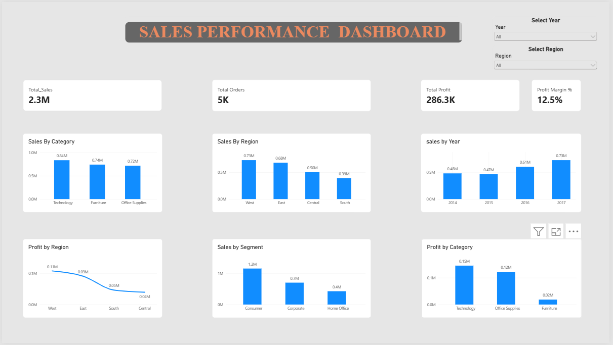

# Superstore Sales Data Analysis

## Project Overview

An end-to-end Sales Data Analysis project using Excel, SQL, MySQL, and Power BI to analyze sales, profit, customers, products, regions, categories, and overall business performance.

## Objective

The objective of this project is to analyze Superstore sales data, identify business trends, measure profitability, and create an interactive dashboard to support data-driven decision making.

## Tools & Technologies

- Excel – Data cleaning and exploratory analysis
- MySQL – Data storage and SQL analysis
- SQL – Business data analysis
- Power BI – Interactive dashboard and visualization
- DAX – KPI calculations and measures

## Project Workflow

1. Cleaned and prepared the raw sales data using Excel.
2. Imported the cleaned dataset into MySQL.
3. Performed SQL-based sales and profitability analysis.
4. Created KPIs and measures using DAX.
5. Built an interactive Power BI dashboard.
6. Analyzed sales and profit by category, region, segment, product, and year.
7. Derived key business insights from the analysis.

## Key KPIs

- Total Sales: ~$2.30M
- Total Profit: ~$286.3K
- Total Orders: ~5K
- Profit Margin: ~12.5%

## Key Business Insights

- Technology generated the highest sales and profit among categories.
- The West region recorded the highest sales and profit.
- The South region recorded the lowest sales.
- Consumer was the highest-performing customer segment by sales.
- Furniture had the lowest profitability among categories.
- 2017 recorded the highest sales.
- The analysis highlights opportunities to improve low-performing regions and product categories.

## Dashboard


The Power BI dashboard provides an interactive view of:

- Sales Performance
- Profit Performance
- Sales by Category
- Sales by Region
- Sales by Segment
- Profit by Category
- Profit by Region
- Year-wise Sales Trends

Conclusion

This project demonstrates an end-to-end data analysis workflow, from data cleaning and SQL analysis to KPI development and interactive Power BI visualization.


## Project Files

```text
Superstore-Sales-Analysis/
├── README.md
├── Excel/
│   ├── Superstore.cleaned.xlsx
│   └── cleanedsalesdata.csv
├── SQL/
│   └── Superstore_Sales_Analysis.sql
├── PowerBI/
│   └── Superstore_Sales_Dashboard.pbix
└── Screenshots/
    └── dashboard.png
